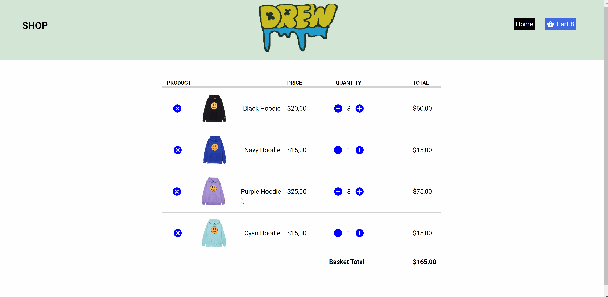

# JavaScript-Shopping-Cart-Feature
Add, Edit, Remove in cart.

## Demos and Screenshot 

-----

  <h2>Add to Cart</h2>

-----

  <h2>Edit Quantity</h2>

-----

  <h2>Remove Item from Cart</h2>

-----

